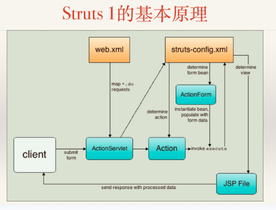
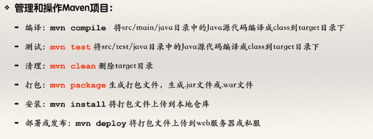

# 软件开发架构平台(课程)
---

### [相关PPT点此跳转](https://pan.baidu.com/s/1ge1J4aYsJs2pMEF6sPLY8Q?pwd=rxk4)

---
## CH01:开发技术与框架技术概述
- 当前的开发平台仅使用JavaEE平台
一个企业级Web项目包括
- 开发架构(人)
  - 系统分层MVC
  - 前后端分离
  - 各种**框架技术**
  - ...
- 系统架构(机器):在后续Linux平台开发课程学习
  - 数据缓存技术
  - 服务器集群部署
  - 服务和Rest API设计
  - ...
> 这些框架的存在目的都是:利好分工写作,效率提升,便于维护拓展;

### 框架技术的由来
随着MVC架构成为流行事实,产生两个问题:
1. 如何约束程序员使用MVC架构;
2. 如何简化开发流程,规范代码;
发现(Servlet为例):
- Servlet开发流程基本一致:获取数据,处理数据,响应结果;
- 具体获得的数据不同,处理方法不同,返回界面不同;
基于以上结论,表示层框架使用配置文件设计可变部分,不可变部分由框架确定下来;
- 约束了规范;提高了开发效率;是项目还能有**较好的**可维护性和可拓展性;

- 表示层框架:Struts,Spring MVC...
- 持久层框架:Mybatis,Hibernate...
- 容器框架:Spring,EJB...
> 现在的SSM为:SpringBoot,Spring MVC, MyBatis

### 理解框架(Struts为例)
Struts历史:忽略...,只需知道Struts 1.x和2.x并没有必要的更新换代联系,借鸡生蛋罢了;

1. 配置web.xml接管.do网页请求,完成servlet-mapping
2. 创建ActionForm对象(如User类继承ActionForm)
3. 创建Action对象(如LoginAction继承Action):将ActionForm作为参数直接传递给Action,通过配置可直接获取数据,简化获取过程;
4. 完成struts-config.xml配置,完成action-mapping,配置返回的响应视图,也配置视图对应的Bean
5. 返回视图

在软件开发的过程中，由于使用第三方框架技术而导致项目自身代码的改变，被称为框架/架构的**侵入性**

Struts 2的基本原理
> 主要改进思想,约定优于配置

- 由Servlet接管改为Filter接管
- 创建POJO类
- 创建Action类(如UserAction),其中包含User对象,各种方法(如Login(),Execute()...)
- 配置struts.xml

### Maven简介
这个,通俗

#### Maven仓库

#### Maven文件结构约定

#### 使用Maven创建和管理项目
可以创建Maven项目或将已有项目更改为Maven项目
管理和操作方法:
