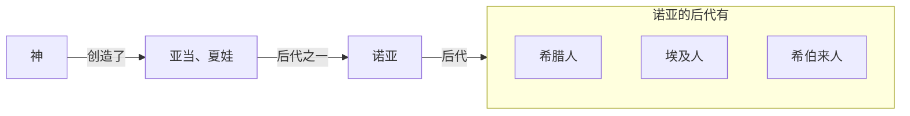
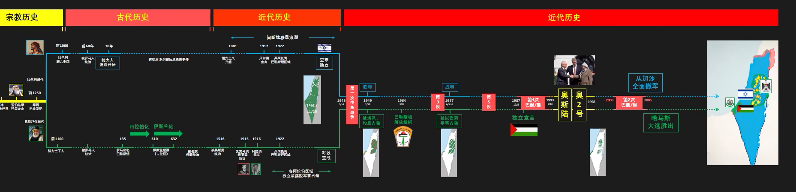

## 以色列

keyword：神的选民 犹大 锡安主义 贝尔福宣言 
西方传说中：

亚伯拉罕（希伯来人）在耶和华指引下从乌尔到迦南生活，一子Jacob，与天使摔跤（？），赐名Israel，他的十二个儿子的后代被称为以色列人。
在迦南大饥荒时，一子摩西带领以色列人前往埃及，后发生“出埃及记”，在神的帮助下度过红海回到迦南。
后建立第一个王国形态，君王依次为：扫罗-大卫-所罗门，之后分裂北以色列王国（后被亚述王国灭亡）和犹大王国（包括犹大部族和另一个部族，依附亚述，后在反抗巴比伦王国时灭亡）。
从此，约公元70年，犹太人（各种翻译最终的译名）的两千年流浪开始。

部分犹太人认为耶稣是语言中的救世主，开始向非犹太人传教（这就是基督教，原犹太教中没有耶稣，也只传犹太人），约390年，成为罗马国教。
犹太人被认为是杀害耶稣的罪人，又是有钱佬，黑心狗商，常年被欧陆人民排斥，比如十字军东征顺手征掉的路边犹太人，黑死病时作为祭品上供犹太人。这激起了锡安主义（Xionism，锡安是耶路撒冷旁的一座山，是大卫王建立的大卫之城所在）的诞生和盛行，视迦南附近那块为**应许之地**（还是耶和华给亚伯拉罕说的那一套）。
英国外交大臣贝尔福的一封信，“贝尔福宣言”，支持建立犹太人的民族地区，在巴勒斯坦。确实，不碍带英的事，还能在敌对领土有个友好势力。于是有人将英国视为自己的再生父母。
1940年的犹太人大屠杀（最后的议案，新时代背景下的工业化犹太人销毁工程，德国人看这犹太人一直赶不出欧洲大陆，决定来个最后的工程），让犹太人的“思乡”情节达到高潮。
于是犹太人就回去了，前往已经不再是迦南的，居住着阿拉伯人的 “巴勒斯坦”，找寻自己的“应许之地”。
最终国际将巴勒斯坦地区分为了犹太国（就是以色列，旗帜是“大卫之星”，当年以色列王国第二任国王，犹大部族）和阿拉伯过（巴勒斯坦）

## 巴勒斯坦
keyword：伊斯兰教

神话中，诺亚后代中的另一支，在埃及诞生了分支-腓力士丁人（后来也灭了，与以色列王国类似），又前往了迦南，与迦南人共同生活在迦南地区，后来亚伯拉罕的后代打败迦南人，与腓力士丁人共同生活。
迦南的基督教起源之后，东南方来的阿拉伯人接受这种思想，而麦加的阿拉伯人，穆罕默德，在神话受天使的启示说的话，被编纂成《古兰经》也就是伊斯兰教的教义。
古兰经与基督教和犹太人记载的都是同一时段历史，但不同在于，古兰经认为亚伯拉罕的大儿子，也就是和二房生的孩子，前往了南方，也就是麦加，产生了阿拉伯人，是阿拉伯人的起源。而不是其他宗教记载中的路边角色。（大妻所生的孩子为Issac，后代是Israel）。
伊斯兰（Islam，服从、归顺（于神））
伊斯兰教认为亚伯拉罕于神的契约在大儿子身上也有（你会在迦南发达！）
此后，巴勒斯坦（罗马帝国宣称的名字）成为了以阿拉伯人为主，伊斯兰教为宗教的区域。而被奥斯曼帝国占领后，帝国实行米利（millet）政策，允许其他教派存在社区，此时该区域犹太人仍为少数（8%）。
当后续犹太人增多时，阿拉伯人也正在谋求独立，领导人物为当时的侯赛因-本阿里，英国败退奥斯曼时，为保住苏伊士运河，于侯赛因协议起义反抗奥斯曼，并承诺把北边一大块给阿拉伯人。
但英国在之后与法国偷摸达成协议“共同”“划分”“代管”了那一大片土地。
此外，还有提到过的贝尔福宣言，给犹太人的：National Home。太有左右逢源了。
后来侯赛因三个儿子各奔前途，给带英当狗的（英托巴勒斯坦地区，后独立为约旦），去（英托）叙利亚的（后来独立为叙利亚），留自己一小块地的（后来被沙特家族，也是阿拉伯人，吞了，也就是现在的沙特阿拉伯。
所以在阿拉伯人严重，犹太国，就是西方人支持的，入侵者，占领他们从七世纪开始生活的土地。

