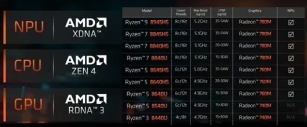

---
## CPU

#### AMD 8040（移动端）
- 锐龙8040系列和前代一样，采用了Zen 4的CPU架构，最高为是8核心16线程，依然是RDNA 3核显，最高12个计算单元。
- AI单元：升级了XDNA NPU，AI算力从10TOPS到16TOPS，整体算力从33TOPS增加到39TOPS，整体性能约提升40%
- 共九个SKU：
  - 8045HS、8040HS、8040U
  - 
  - 8040HS基本为8045HS的低TDP和CPU频率版本，8040U和7040U基本对应
- 代号为“Strix Point”的下一代移动处理器将在明年内登场，预计CPU会升级为全新的Zen 5架构，GPU则会使用RNDA 3.5架构，并且NPU部分会升级到XDNA 2架构，生成式AI性能提升3倍;
- 总结：挤牙膏，不过升级了NPU；和英特尔那边的Meteor Lake也是首次集成了NPU保持一致；

#### AMD 8000G处理器
- AMD桌面端8000G系列APU，2024农历新年前发布
- 与此前的锐龙5000G系列一样，锐龙8000G系列依然使用了与移动端共用架构的产品设计思路。
- 锐龙8000G系列中的8700G和8600G两款型号，内置了AMD的第二代XDNA加速器，支持16TOPs的硬件AI算力。当时仅有的主流桌面NPU量产产品