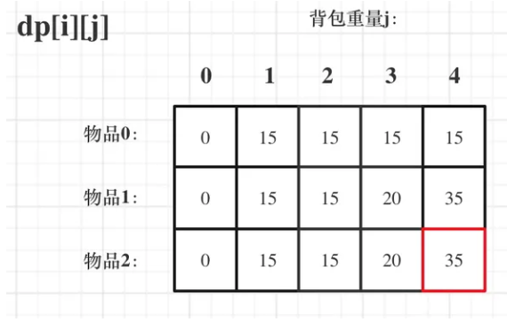
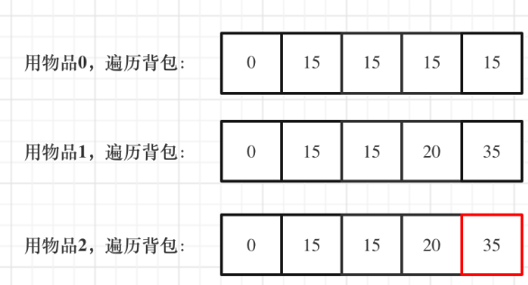

---
## 动态规划问题
### 1. 基本要素
- 最优子结构性质
- 重叠子问题性质
### 2. 算法设计步骤
1. 找出最优解的性质，刻画结构特征
2. 递归的定义最优值
3. 自底向上的方式计算最优值
4. 根据计算最优值时得到的信息构造最优解
### 3. 具体问题
#### 3.1 0-1背包问题
1. 最优子结构性质
   相应子问题的最优解:
   $$
   max\sum^n_{i=2}v_ix_i=
   \begin{cases}
      \sum_{i=2}^nw_ix_i\leq c-w_iy_1,\\
      x_i\in \{0,1\}
   \end{cases}
   $$
   易知具有最优子结构性质
2. 递归关系
    $$
   m(i,j)=
   \begin{cases}
      \max\{m(i+1,j),m(i+1,j-w_i)+v_i\}, j\leq w_i\\
      m(i+1,j),0 \leq j < w_i
   \end{cases}
   $$
   $$
   m(i,j)=
   \begin{cases}
      v_n,j\geq w_n\\
      0,0 \leq j < w_n
   \end{cases}
   $$
3. 初始化
   关于初始化，一定要和dp数组的定义吻合，否则到递推公式的时候就会越来越乱。
   ~~~c++
   {
      // 初始化 dp
      vector<vector<int>> dp(weight.size() + 1, vector<int>(bagWeight + 1, 0));
      for (int j = weight[0]; j <= bagWeight; j++) {
         dp[0][j] = value[0];
      }
   }
   ~~~
4. 确定遍历顺序
   
   ~~~c++
   // weight数组的大小 就是物品个数
   for(int i = 1; i < weight.size(); i++) { // 遍历物品
      for(int j = 0; j <= bagWeight; j++) { // 遍历背包容量
         if (j < weight[i]) dp[i][j] = dp[i - 1][j]; // 这个是为了展现dp数组里元素的变化
         else dp[i][j] = max(dp[i - 1][j], dp[i - 1][j - weight[i]] + value[i]);
      }
   }

   // weight数组的大小 就是物品个数
   for(int j = 0; j <= bagWeight; j++) { // 遍历背包容量
      for(int i = 1; i < weight.size(); i++) { // 遍历物品
         if (j < weight[i]) dp[i][j] = dp[i - 1][j];
         else dp[i][j] = max(dp[i - 1][j], dp[i - 1][j - weight[i]] + value[i]);
      }
   }     
   ~~~

   > ***要理解递归的本质和递推的方向。***
   > dp[i][j] = max(dp[i - 1][j], dp[i - 1][j - weight[i]] + value[i]); 递归公式中可以看
   > dp[i][j]是靠dp[i-1][j]和dp[i - 1][j - weight[i]]推导出来的。
   > dp[i-1][j]和dp[i - 1][j - weight[i]] 都在dp[i][j]的左上角方向（包括正左和正上两个方向）
   > 虽然两个for循环遍历的次序不同，但是***dp[i][j]所需要的数据就是左上角***，根本不影响dp[i][j]公式的推导！
   >***背包问题里，两个for循环的先后循序是非常有讲究的***
5. 举例
   

> 完整代码此处[^01PackExample]
      
[^01PackExample]: 
      ~~~c++
      void test_2_wei_bag_problem1() {
         vector<int> weight = {1, 3, 4};
         vector<int> value = {15, 20, 30};
         int bagWeight = 4;

         // 二维数组
         vector<vector<int>> dp(weight.size() + 1, vector<int>(bagWeight + 1, 0));

         // 初始化
         for (int j = weight[0]; j <= bagWeight; j++) {
             dp[0][j] = value[0];
         }

         // weight数组的大小 就是物品个数
         for(int i = 1; i < weight.size(); i++) { // 遍历物品
             for(int j = 0; j <= bagWeight; j++) { // 遍历背包容量
                 if (j < weight[i]) dp[i][j] = dp[i - 1][j];
                 else dp[i][j] = max(dp[i - 1][j], dp[i - 1][j - weight[i]] + value[i]);

             }
         }
         cout << dp[weight.size() - 1][bagWeight] << endl;
      }
      int main() {
          test_2_wei_bag_problem1();
      }
      ~~~

#### 3.2 DP数组(滚动数组)
对于背包问题其实状态都是可以压缩的

如果把dp[i - 1]那一层拷贝到dp[i]上，表达式完全可以是：dp[i][j] = max(dp[i][j], dp[i][j - weight[i]] + value[i]);

于其把dp[i - 1]这一层拷贝到dp[i]上，不如只用一个一维数组了，只用dp[j]（一维数组，也可以理解是一个滚动数组）。

这就是滚动数组的由来，需要满足的条件是上一层可以重复利用，直接拷贝到当前层。

1. 所以递归公式为：

> dp[j] = max(dp[j], dp[j - weight[i]] + value[i]);

2. 初始化:
   全为零
3. 遍历:
   倒序:防止重复
   > 那么问题又来了，为什么二维dp数组历的时候不用倒叙呢？
   因为对于二维dp，dp[i][j]都是通过上一层即dp[i - 1][j]计算而来，本层的dp[i][j]并不会被覆盖！

   > 一维数组必须先遍历物品
4. 举例
   

#### 3.3 最长公共子序列

思考：倒序排除，可以排除肯定不一样的