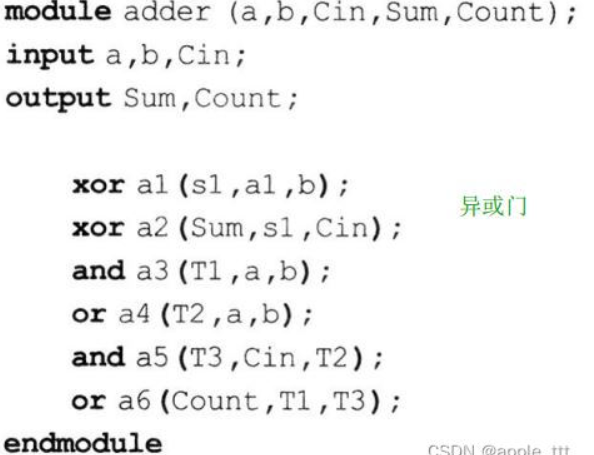
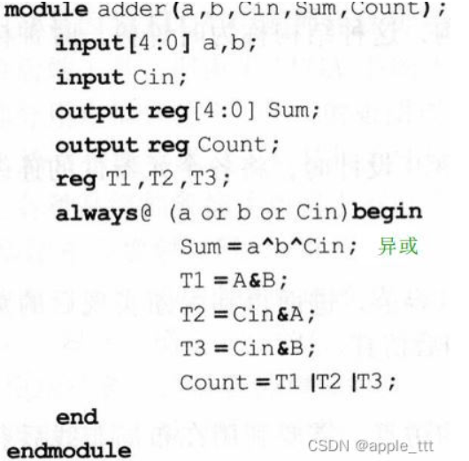
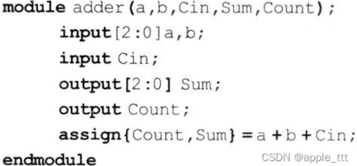
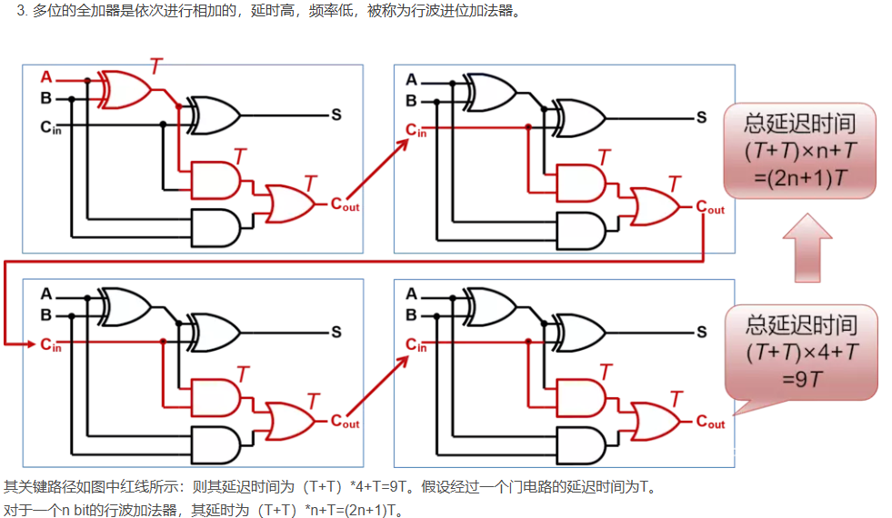
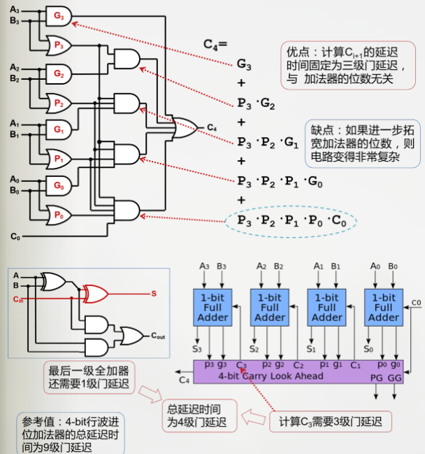

## 组合电路时序参数
传播延迟(T_pd) : 输入端开始变化 -- 输出端稳定
污染延迟(T_cd) : 输入端开始变化 -- 输出端开始变化
组合电路的传播延迟：关键路径(最长的路径)的传播延迟之和，也就是从有变化到彻底结束
组合电路的最小延迟：最短的路径的污染延迟之和，也就是从开始有输入信号到输出开始变化
建立时间(t_s) : 时钟沿到来前输入数据D必须要稳定的时间
保持时间(t_h) : 时钟沿到来后输入数据D必须要稳定的时间

## 有限状态机
Moore有限机 : 仅取决于当前状态
Mealy有限机 : 取决于当前状态和当前输入

## 同步时序电路的设计

## 电路描述层次
1. 布尔描述
布尔描述一种逻辑表达形式，直接简洁地描述了电路逻辑：
2. 门级描述 
门级建模比较接近电路底层,设计时主要考虑使用到了哪些门,然后按照一定的顺序连接线组成一个大的电路,所以注重的是门的使用,关键的语法在于门的实例化引用。一个完整的门级描述实例一般包含模块定义、端口声明,内部连线声明,门级调用等几个部分。

3. RTL级描述
RTL，Register Transfer Level，直译为寄存器转换级，顾名思义，也就是在这个级别下，要描述各级寄存器（时序逻辑中的寄存器），以及寄存器之间的信号的是如何转换的（时序逻辑中的组合逻辑）。

1. 行为级描述
常常只用于验证仿真

## 综合和仿真
### 1.综合
Verilog 是硬件描述语言，顾名思义，就是用代码的形式描述硬件的功能，最终在硬件电路上实现该功能。 在 Verilog 描述出硬件功能后需要使用综合器对 Verilog 代码进行解释并将代码转化成实际的电路来表示，最终产生实际的电路， 也被称为网表。这种**将 Verilog 代码转成网表的工具就是综合器**。

### 2.仿真
在综合前， 设计师可以在电脑里通 过仿真软件对代码进行仿真测试， 检测出 BUG 并将其解决，最后再将程序烧写进 FPGA。
为了模拟真实的情况，需要编写**测试文件**。该文件也是用 Verilog 编写的， 其描述了仿真对象的输入激励情况。

### 3.可综合设计
有些语法结构只是以仿真测试为目的，是不能与实际硬件电路对应起来的。 也就是说在使用这些语法时， 将一个语言描述的程序映射成实际硬件电路中的结构是不能实现的，也称为不可综合语法。
- 不可综合，是指找不到对应的“门”器件来实现相应的代码
- 有**不可综合或者不推荐使用的代码** 和 **推荐使用的设计代码**

## HDL(硬件描述语言)
###
HDL(硬件描述语言)一般分为**SystemVerilog**和**VHDL**
#### verilog
1. 描述硬件有哪些成分：
~~~verilog
Module 名称（接口描述）；
内部变量描述；
元件描述；
Endmodule

接口描述：input,output,in,out
内部变量描述：wire,reg,tri
元件描述：
①组合：assign,always
②时序：always
③高级结构：task function
(①②为流程控制)
~~~
2. 如何描述测试程序
~~~verilog
Module
测试程序名称（）；
内部变量；
被测模块实例化；
产生输入信号（initial）:
比较输出与预期结果（验证）；（$内部表达式）
Endmodule
~~~

## 半加器与全加器
### 1.半加器
加法没有考虑低位来的进位，所以称为半加。
### 2.全加器
全加器能进行加数、被加数和低位来的进位信号相加，并根据求和结果给出该位的进位信号。
### 3.行波进位加法器

### 4.超前进位加法器

## ALU

## 浮点数的表示和如何实现加法运算
1位符号,8位阶码,23位尾数,**前导1**,**偏置阶数**

## RAM & ROM
RAM与ROM是计算机中常见的存储器类型，它们在数据存储和访问方面扮演着重要的角色。RAM（Random Access Memory）是一种**临时存储器**，用于存储计算机正在运行的程序和数据。它具有**快速的读写速度和随机访问**的特点。相比之下，ROM（Read-Only Memory）是一种只读存储器，用于**存储固定的程序指令和数据**。ROM中的数据在计算机断电时不会丢失，因此被称为**非易失性存储器**。

### 1.RAM

分类:
1. DRAM:
使用电容和电流来存储数据，并且需要刷新操作以保持数据的稳定性
2. SRAM
- SRAM是另一种常见的RAM类型，相对于DRAM来说，更快、更稳定。
- 它使用存储触发器（通常是互补金属氧化物半导体CMOS电路）来存储数据。
- SRAM速度快，但比DRAM成本更高，一般用于高性能缓存和高速缓冲存储器。
3. SDRAM（同步动态随机存取存储器）
4. DDR SDRAM（双倍数据率同步动态随机存取存储器）
它通过在每个时钟周期内传送两次数据，实现更高的带宽和更快的数据访问速度

### 2.ROM
ROM是一种只读存储器，其中的数据不能被常规方式修改或写入。它包含了固定的数据，例如启动程序、固件等。
1. MASK ROM（掩模只读存储器）：
- MASK ROM是在制造过程中被预先编程的ROM类型，无法在常规操作下进行修改。
- 它的数据是通过光刻等工艺制作在芯片上的，被“硬编码”进入芯片的电路结构中。
- MASK ROM适用于存储固定的启动程序、固件等代码。
2. PROM（可编程只读存储器）：
- PROM是一种可编程的只读存储器，用户可以通过编程操作一次性地将数据写入其中。
- 编程操作通常由专用的编程设备或编程器完成，一旦写入数据后，数据将无法修改。
- PROM适用于需要存储不可更改数据的应用，如设备固件等。
3. EPROM（可擦除可编程只读存储器）：
- EPROM是一种可擦除的可编程ROM，允许用户多次编程和擦除操作。
- EPROM使用紫外线擦除器件来擦除数据，然后通过编程器进行重新编程。
- EPROM通常用于存储需要经常更新的程序和数据的应用。
4. EEPROM（电可擦除可编程只读存储器）：
- EEPROM是一种电可擦除的可编程ROM，相对于EPROM，它不需要紫外线擦除器件。
- EEPROM可以通过电压脉冲来擦除和编程数据，使得操作更加方便和可靠。
- EEPROM广泛应用于存储配置数据、校准数据、设备序列号等的场景。
5. Flash存储器：
- Flash存储器是一种基于EEPROM技术的存储器，具有非易失性和高密度的特点。
- Flash存储器可以通过块擦除方式进行修改，相比EEPROM更具灵活性和可编程性。
- Flash存储器广泛应用于各种存储需求，如固件存储、系统存储、可移动存储介质等。

#### posedge
在Verilog中，posedge是一个触发器，用于检测信号的上升沿。当信号从低电平变为高电平时，posedge会触发一个事件。
~~~verilog
always @(posedge clk) 
begin 
// 在时钟上升沿触发的代码 
end
~~~
这段代码表示，当时钟信号（clk）的上升沿到来时，会触发always块中的代码。这种方式常用于时序逻辑的设计，例如寄存器、计数器等。

# 参考

[电路描述层次](https://blog.csdn.net/apple_53311083/article/details/134859644)
[verilog 里面，always，assign和always@(*)区别](https://blog.csdn.net/wordwarwordwar/article/details/101114439)
[串行（行波）进位加法器](https://www.cnblogs.com/yiquwange/p/14988026.html)