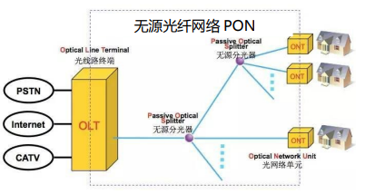

# 计算机网络

## 网络分类

- 按地域规模
    - PAN
    - LAN
    - MAN
    - WAN

## 互联网的层级结构
- Tier 1 ISP
- Tier 2 ISP

## 互联网的构成 
- 网络边缘:*端系统*
  - 端系统由各类主机(host)构成
    *主机*:各种功能
    - 客户端
    - 服务端
  - 接入网目的是将主机连接到边缘路由器上
    *边缘路由器*:端系统去往任何远程端系统的路径上的第一台路由器
    连接方式:FTTH&同轴电缆&...&WIFI&4G&...
      - FTTH:光纤到户Fiber to the home
        带宽大,稳定
        分类: 
          - 有缘光纤网络(AON)
          - 无源光纤网络(PON,Passive Optical Network)
            OLT:局部的光线路终端
            ONU(光网络单元):如光猫ONT
            光猫ONT通过一个或多个无源分光器,连接到局端的光线路终端OLT
            
      - DSL数字用户线
      - 同轴电缆(Cable,HFC)
      - 无线接入
        - 无线局域网(WLAN):Wifi
        - 广域蜂窝接入网:2/3/4/5G等
- 网络核心:由互联*端系统*的分组交换设备和通讯链路构成的*网状网络*
    - 分组交换(也叫包交换):路由器&链路层交换机
    - 通讯链路:光纤&铜缆&无线电&激光链路
    功能:路由:确定数据分组从S到T的路径
        转发:将接收到的分组转发出去,即移动到该设备的某个接口

## 网络协议
三要素:
- 语法:传输数据的格式(如何讲),
- 语义:要完成的功能(讲什么),包括协调和差错控制的信息
- 时序:各种操作的顺序(讲话顺序)
协议分层结构必要性:分层结构&统一标准&模块独立
协议分层结构:
    层次栈:一个特定系统的一组协议,即每层的协议
    对等实体:不同机器上相应层次的实体
    接口:定义下层向上层提供的原语
    网络体系结构:层和协议的集合
服务原语:
- 面向连接
- 无连接

## 参考模型
OSI(理论指导)
    Open Systems Interconnection
    各个层看PPT吧
IEEE 802LAN协议(局域网组网)
TCP/IP协议(网络互连)
    以其中最主要的两个协议命名
    与OSI(先有模型后设计协议)相比,仅仅是对已有协议的描述(实现的描述)

# 物理层

## 基本概念
定义
功能
接口特性：
  DTE：所有具有作为二进制数字数据源点或终点能力的单元
  DCE：任何能够通过网络发送和接收模拟或数字数据的功能单元
  > 如电脑_Modem_Modem_电脑,就是一种DTE-DCE-DCE-DTE

  标准的DTE/DCE接口具有
  - 机械特性:实际物理连接
  - 电气特性:数据交换信号和有关电路的特性
  - 功能特性:某条线的某电平的意义,或者说接口执行的功能
  - 规程特性:各信号线的工作规则和先后顺序,或不同功能的各种事件的可能出现顺序
物理层协议是DTE和DCE中间的约定,规定了两者之间的接口特性
常用标准
  - 点对点通信线路
  - 广播通信线路

## 数据通信基础
频谱: 是一个信号所包含的频率的范围
信号的绝对带宽等于频谱的宽度
> 主要能量集中的频带,称为有效带宽,或带宽(bandwidth)

电气工程:传输过程中振幅不会明显减弱的这一段频率范围（ HZ ）(带宽或通频带)
计算机:一个信道的最大数据速率，每秒多少比特（ bps ）(信道容量)
信道容量C和通频带H之间的关系
   - 奈奎斯特定理:C=2Hlog_2V
   - 香农信道容量公式:C=Hlog_2(1+S/N)   噪声(dB)=10log_10(S/N)

信息传输速率:实际数据传输速率
  波特率B: 单位时间传输的符号数(波形,传送的信号的变化次数)
  比特率b: 单位时间传输的信息量   b=B*log_2(几相调制)*

传输方式:
  串/并
  单工/半双工/全双工
  异步/同步
  基带传输/频带传输

数据编码技术: 数据-数据
研究数据在信号传输过程中怎么编码(变换)
常用方式:
  - 不归零编码(NRZ): 低0高1
  - 不归零反相编码(NRZI): 逢1跳变
  - 曼彻斯特码: 位中间跳变,低到高为0
  - 差分曼彻斯特码: 开始时有跳变为0,中间跳变表示时钟. 
    时钟和数据分离,便于提取
  - 4B/5B编码: 不归零制编码的一种变种,波特率是比特率的1.25倍

频带传输:
三种调制技术: 调频&调幅&调相

## 传输介质
- 导引型传输介质: 电磁波被导向沿着某一媒体传播
  1. 双绞线
  2. 同轴电缆
    分类:
      - 内外导体尺寸:中小微
      - 特性阻抗:基带同轴电缆(50Ω),宽带同轴电缆(75Ω)
  3. 光纤
  4. 电力载波
- 非导引型传输介质: 无线传播
  1. 短波传输（无线电波）
    - 可沿地球表面以地波形式传播（数百千米）
    - 主要以天波的形式靠大气层中的电离层反射传播（达数千～上万千米）
  2. 散射传输（无线电波）
  3. 地面微波
    多路复用、射频工作和中继接力是地面微波传输的三个最基本的工作特点
    远距离通信则采用中继方式
    受地形和天线高度的限制，两通信站之间的距离一般在 40 ～ 60km
  4. 光波传输
    紫外线、可见光和红外线都属于光波的范畴
    光波通信目前有三种分类
     1. 按照光源特性的不同，分为激光通信和非激光通信
     2. 按照传输媒体的不同，分为大气激光通信和光纤通信
     3. 按照传输波段的不同，光波通信分为可见光通信、红外线（光）通信和紫外线（光）通信

## 复用技术

# 数据链路层

## 信道分配问题
*信道*：信号的通道，如双绞线、光纤. 有点到点信道和多点访问信道
常见局域网拓扑:总线、星型、环型拓扑（共同点：共享一个信道）

## MAC层
MAC层: 确定多路访问信道下一个使用者的协议，数据链路层的子层
MAC: 是一种控制使用通信介质的机制，它是数据链路层协议的一部分。
主要问题:如何分配广播信道
  1. 静态分配: 只要一个用户得到了信道就不会和别的用户冲突
  2. 动态分配: 称为多路访问（Multiple Access）或多点接入,这样的系统又称为竞争系统
  动态分配方法又可以分为:
    1. 随机访问，典型ALOHA协议、CSMA协议
    多路访问协议:
    1. ALOHA协议
    2. 分槽ALOHA协议: 冲突主要发生在时间槽的起点
    3. 载波侦听多路访问协议CSMA
    分类:
      1. 坚持型
      2. 非坚持型
      3. p-坚持型
    4. CSMA/CD（具有冲突检测的CSMA） 
    冲突的检测:
      1. 信号电平法
      2. 过零点检测法
      3. 自收发检测法 
    2. 受控访问，典型令牌网竞争系统和集中控制的多点线路轮询
      1. 令牌传递
      代价:令牌维护
  动态信道五个关键假设
  
## 以太网
传统传输媒体:铜缆(10BASE5 & 10BASE2)&铜线(10BASE-T)&光缆(10BASE-F)
经典以太网:普通10M以太网,使用10BASE5,
> 5-4-3-2-1 原则

普通以太网:
1. 10BASE2: 
2. 10BASE-T: 双绞线和星型结构 

MAC地址: 
